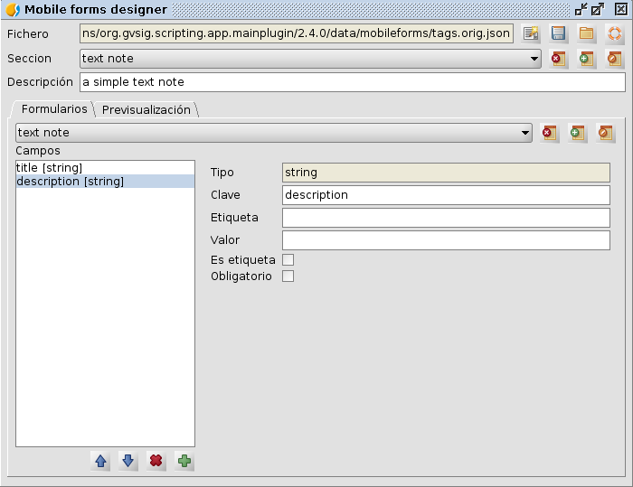

 
Mobile forms designer
=======================

Forms designer for gvSIG mobile.

This tool allows you to edit the file of forms definition "tags.json" of 
gvSIG Mobile from gvSIG desktop.

It allows to create or load a json file with the definition of forms, to create 
new forms or modify existing ones, as well as to show an approximate preview of 
how the form would be in gvSIG mobile.

